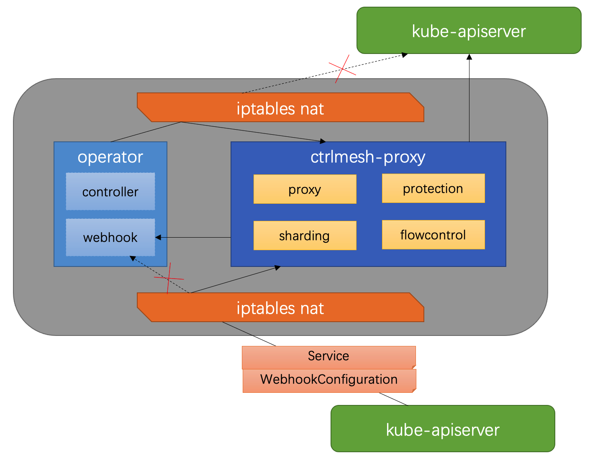

# ControllerMesh

ControllerMesh is a solution that helps developers manage their controllers/operators better.

## Key Features

1. Canary update: the controllers can be updated in canary progress instead of one time replace.
2. Fault injection: it helps developers to verify their reconcile logic in some fault scenarios.
3. Flexible isolation: limits resources of which namespaces can be queried by a controller.
4. Client-side rate-limit and blown.

## Implementation Constraints

Generally, a `ctrlmesh-proxy` container will be injected into each operator Pod that has configured in ControllerMesh.
This proxy container will intercept and handle the connection by between API Server and controllers/webhooks in the Pod.

